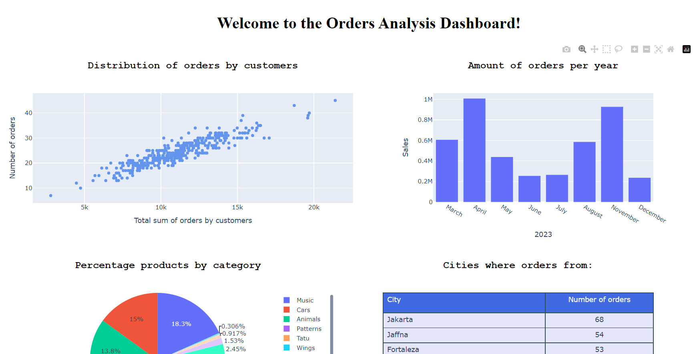
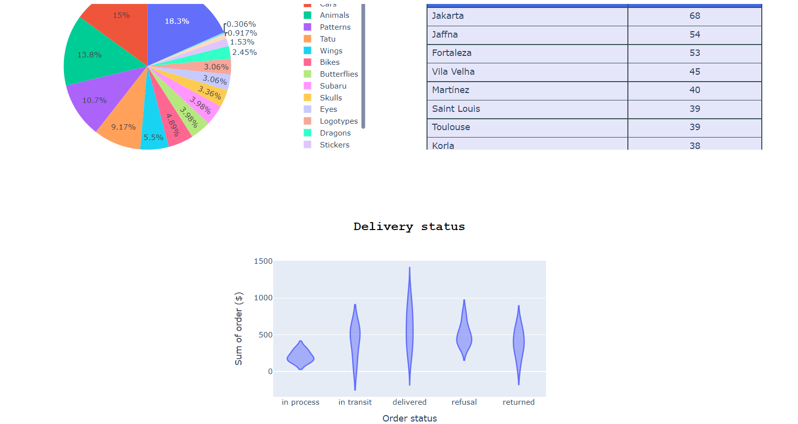

About this application

This application analyzes data obtained from a Sales DataBase.

OUTPUT => Orders Analysis Dashboard with graphs, data visualization in Python

Relational database of clients and their orders is presented in image "Structure of BD work.jpg" :
Connection:
Host:	  84.201.152.11
Port:	  19001
DataBase: sqlfree-5
Shema:    work

"""
Description
""""

How to run this app:

First, clone this repository and open a terminal inside the root folder.

Create and activate a new virtual environment (recommended) by running the following:

python -m venv myvenv

myvenv\Scripts\activate

Install the requirements:

pip install -r requirements.txt
Run the app:

python dashboard.py
Open a browser at http://127.0.0.1:8050/

Notes:
The project development is in progress. 

